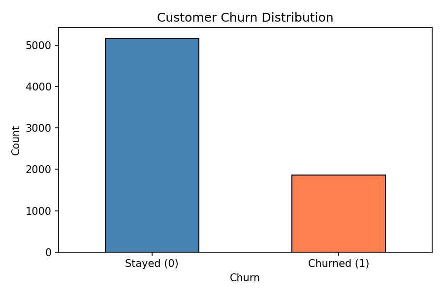
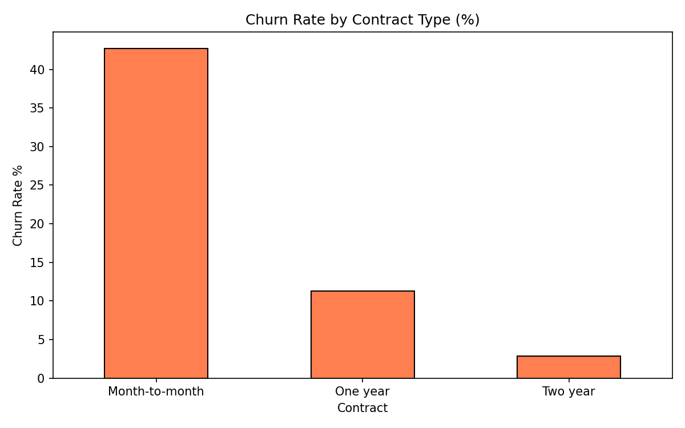
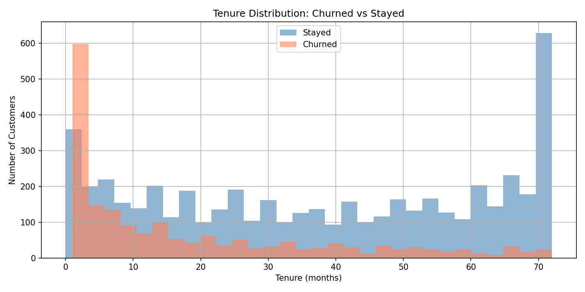
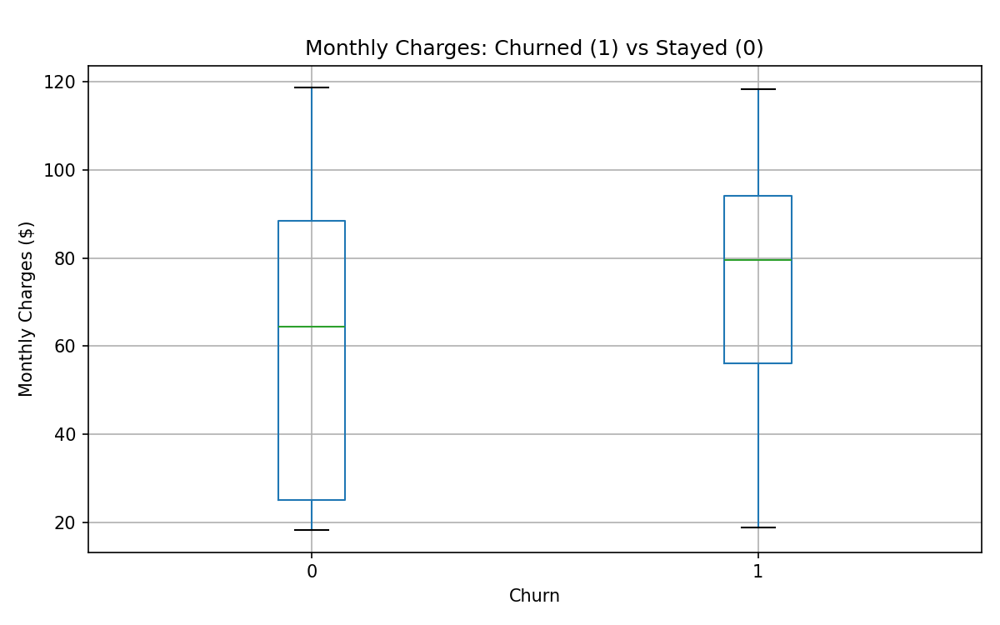
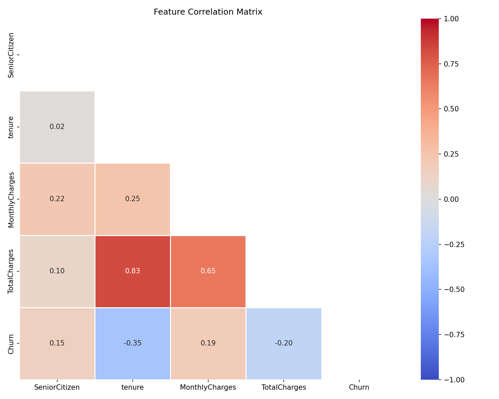
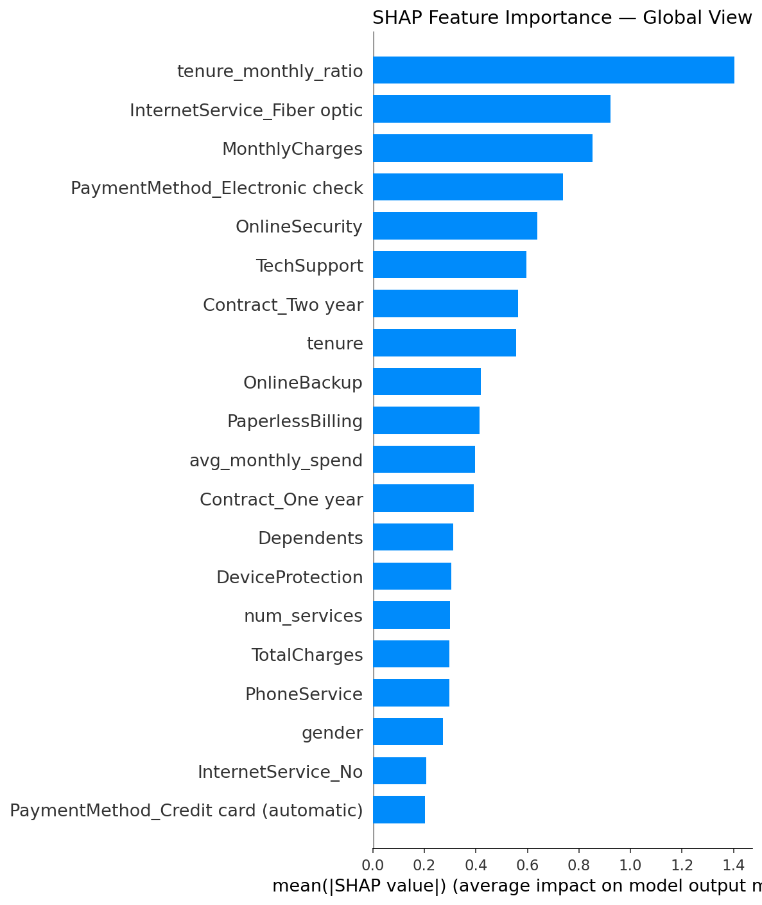
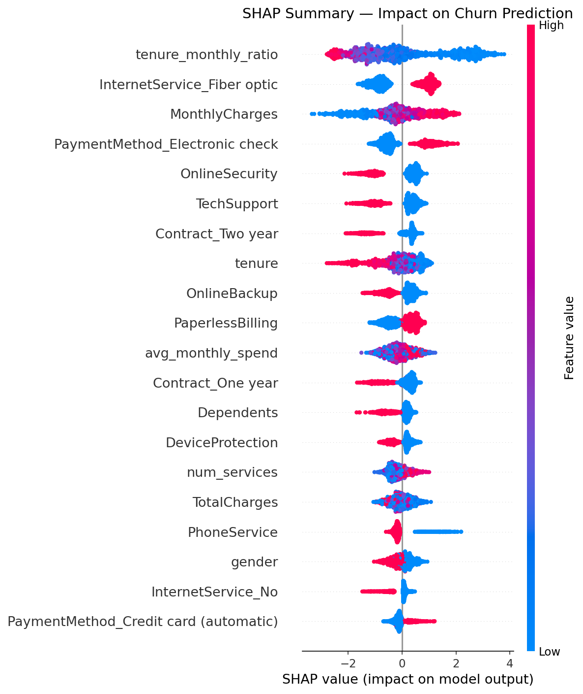

# 🔮 ChurnSense — Customer Churn Prediction System

<div align="center">


**An end-to-end machine learning system that predicts telecom customer churn with 83% AUC-ROC, powered by a hyperparameter-tuned XGBoost model, SHAP explainability, and a production-ready Flask web application.**

[Live Demo](#-web-application) · [Model Results](#-model-performance) · [SHAP Analysis](#-shap-explainability) · [Getting Started](#-getting-started)

</div>

---

## 📌 Project Overview

Customer churn is one of the most expensive problems in the telecom industry — acquiring a new customer costs **5–7× more** than retaining an existing one. This project builds a complete ML pipeline that:

- Cleans and engineers features from raw telecom data
- Handles severe class imbalance using **SMOTE-ENN** resampling
- Trains and compares **3 classifiers** with threshold tuning
- Performs **50-iteration RandomizedSearchCV** hyperparameter optimization
- Explains predictions with **SHAP values** at global and individual customer level
- Deploys as a **Flask REST API** with a beautiful interactive frontend

---

## 🏗️ Architecture

```
churn_data.csv
      │
      ▼
┌─────────────────────────────┐
│   Data Cleaning & EDA       │  ← TotalCharges fix, encoding, visualizations
└────────────┬────────────────┘
             │
             ▼
┌─────────────────────────────┐
│   Feature Engineering       │  ← avg_monthly_spend, num_services,
│                             │    tenure_monthly_ratio, high_spender
└────────────┬────────────────┘
             │
             ▼
┌─────────────────────────────┐
│   SMOTE-ENN Resampling      │  ← Fixes 73/27 class imbalance
└────────────┬────────────────┘
             │
             ▼
┌─────────────────────────────┐
│   Model Training            │  ← Logistic Regression
│   & Comparison              │    Random Forest
│                             │    XGBoost
└────────────┬────────────────┘
             │
             ▼
┌─────────────────────────────┐
│   Hyperparameter Tuning     │  ← RandomizedSearchCV (50 iter, 5-fold CV)
│   (XGBoost)                 │    Best CV AUC-ROC: 0.9906
└────────────┬────────────────┘
             │
             ▼
┌─────────────────────────────┐
│   SHAP Explainability       │  ← Global importance + individual waterfall
└────────────┬────────────────┘
             │
             ▼
┌─────────────────────────────┐
│   Flask API + Web UI        │  ← Real-time churn probability + retention tips
└─────────────────────────────┘
```

---

## 📊 Dataset

| Property | Value |
|----------|-------|
| Source | IBM Telco Customer Churn Dataset |
| Records | 7,043 customers |
| Features (raw) | 21 |
| Features (engineered) | 26 |
| Churn Rate | 26.5% (imbalanced) |
| Target | Binary — `Churn: Yes/No` |

**Key raw features:** `tenure`, `MonthlyCharges`, `TotalCharges`, `Contract`, `InternetService`, `PaymentMethod`, and 15 service subscription flags.

**Engineered features:**

| Feature | Formula | Insight |
|---------|---------|---------|
| `avg_monthly_spend` | `TotalCharges / (tenure + 1)` | Smoothed spending rate |
| `is_new_customer` | `tenure ≤ 12` | First-year vulnerability flag |
| `num_services` | Sum of 7 service flags | Bundle depth proxy |
| `tenure_monthly_ratio` | `tenure / (MonthlyCharges + 1)` | Value-for-money score |
| `high_spender` | Top 25th percentile monthly charges | Premium segment flag |

---

## 📈 Exploratory Data Analysis

<table>
<tr>
<td width="50%">

### Churn Distribution

> Dataset is **imbalanced** — 73% stayed, 27% churned. SMOTE-ENN applied to balance training set.

</td>
<td width="50%">

### Churn Rate by Contract Type

> Month-to-month customers churn at **42%** vs just 3% for two-year contracts. Contract type is a primary retention lever.

</td>
</tr>
<tr>
<td width="50%">

### Tenure Distribution

> Churners cluster heavily in **months 0–12**. Long-tenure customers are significantly more loyal.

</td>
<td width="50%">

### Monthly Charges vs Churn

> Churned customers have a **median ~$80/month** vs ~$65 for retained customers — higher charges correlate strongly with churn.

</td>
</tr>
</table>

### Feature Correlation Matrix


Key correlations with `Churn`:
- `tenure` → **-0.35** (longer tenure = far less churn)
- `MonthlyCharges` → **+0.19** (higher bills = more churn)
- `TotalCharges` → **-0.20** (paradoxically negative, mediated by tenure)

---

## 🤖 Model Performance

Three classifiers were trained on the SMOTE-ENN resampled training set and evaluated on the held-out 20% test set.

### Default Threshold Comparison

| Model | Accuracy | Precision | Recall | F1 Score | AUC-ROC | Train Time |
|-------|----------|-----------|--------|----------|---------|------------|
| Logistic Regression | 0.6998 | 0.4644 | 0.8556 | 0.6021 | 0.8323 | 0.96s |
| Random Forest | 0.7154 | 0.4797 | 0.8529 | 0.6141 | 0.8386 | 2.52s |
| **XGBoost** | **0.7161** | **0.4802** | **0.8449** | **0.6124** | **0.8350** | **1.80s** |

### After Threshold Tuning (Optimal F1)

| Model | Threshold | Accuracy | Precision | Recall | F1 Score |
|-------|-----------|----------|-----------|--------|----------|
| Logistic Regression | 0.81 | 0.7672 | 0.5479 | 0.7032 | 0.6159 |
| **Random Forest** | **0.71** | **0.7644** | **0.5398** | **0.7620** | **0.6319** |
| XGBoost | 0.76 | 0.7587 | 0.5315 | 0.7674 | 0.6280 |

### Hyperparameter-Tuned XGBoost (Final Model)

> RandomizedSearchCV · 50 iterations · 5-fold StratifiedKFold · Scoring: AUC-ROC

**Best Parameters Found:**
```python
{
  'n_estimators':     382,
  'max_depth':        8,
  'learning_rate':    0.0813,
  'subsample':        0.7708,
  'colsample_bytree': 0.7297,
  'gamma':            0.0610,
  'min_child_weight': 1
}
```

| Metric | Value |
|--------|-------|
| Best CV AUC-ROC | **0.9906** |
| Test AUC-ROC | **0.8296** |
| Test F1 Score | **0.5974** |
| Test Recall (churn class) | **0.80** |

> High recall on the churn class (80%) is the business priority — it's far more costly to miss a churning customer than to flag a retained one.

---

## 🔍 SHAP Explainability

SHAP (SHapley Additive exPlanations) makes the model's decisions fully transparent and auditable.

### Global Feature Importance


**Top 5 drivers of churn predictions:**

| Rank | Feature | SHAP Impact | Business Meaning |
|------|---------|-------------|-----------------|
| 1 | `tenure_monthly_ratio` | 1.40 | Low value-for-money → highest churn signal |
| 2 | `InternetService_Fiber optic` | 0.93 | Fiber users churn far more than DSL |
| 3 | `MonthlyCharges` | 0.88 | Price sensitivity is a dominant factor |
| 4 | `PaymentMethod_Electronic check` | 0.74 | E-check users show higher churn tendency |
| 5 | `OnlineSecurity` | 0.66 | No security service → elevated churn risk |

### SHAP Beeswarm Plot (Impact Direction)


> **Red = high feature value, Blue = low feature value.**
> High `tenure_monthly_ratio` (getting good value) **reduces** churn. Fiber optic internet **increases** churn risk regardless of other factors.

---

## 🌐 Web Application

A production-ready Flask REST API serves a dark-themed, animated dashboard built with vanilla HTML/CSS/JS.

### Features
- **Real-time prediction** — churn probability returned in milliseconds
- **Animated gauge meter** — visual probability display with smooth animation
- **Risk marker** — positioned on a color-coded low→high risk track
- **Retention playbook** — prioritized, context-aware action cards
- **Fully responsive** — works on desktop and mobile

### API Endpoint

```bash
POST /predict
Content-Type: application/json

{
  "tenure": 12,
  "monthly_charges": 79.50,
  "total_charges": 954.0,
  "contract": "Month-to-month",
  "internet_service": "Fiber optic",
  "online_security": "No",
  "tech_support": "No",
  "streaming_tv": "Yes",
  "streaming_movies": "No",
  "paperless": "Yes",
  "senior_citizen": "No",
  "payment": "Electronic check"
}
```

**Response:**
```json
{
  "probability": 0.7823,
  "prediction": 1
}
```

---

## 🚀 Getting Started

### Prerequisites
```
Python 3.10+
pip
```

### 1. Clone the repository
```bash
git clone https://github.com/yourusername/churnsense.git
cd churnsense
```

### 2. Install dependencies
```bash
pip install -r requirements.txt
```

### 3. Train the model
```bash
python app.py
# Saves: models/best_xgb_model.pkl, models/scaler.pkl, models/feature_names.pkl
```

### 4. Launch the web app
```bash
pip install flask flask-cors
python app_flask.py
# Open http://localhost:5000
```

### Requirements
```
pandas
numpy
scikit-learn
xgboost
imbalanced-learn
shap
matplotlib
seaborn
joblib
scipy
flask
flask-cors
```

---

## 📁 Project Structure

```
churnsense/
│
├── app.py                    # Full ML pipeline (training, evaluation, SHAP)
├── app_flask.py              # Flask REST API backend
├── requirements.txt
│
├── data/
│   └── churn_data.csv        # Raw Telco dataset
│
├── models/                   # Saved after running app.py
│   ├── best_xgb_model.pkl
│   ├── scaler.pkl
│   └── feature_names.pkl
│
├── static/                   # Web frontend
│   ├── index.html
│   ├── style.css
│   └── script.js
│
└── plots/                    # EDA & SHAP visualizations
    ├── churn_distribution.png
    ├── contract_churn.png
    ├── tenure_distribution.png
    ├── monthly_charges_boxplot.png
    ├── correlation_heatmap.png
    ├── shap_bar.png
    ├── shap_beeswarm.png
    └── shap_waterfall.png
```

---

## 💡 Key Technical Decisions

**Why SMOTE-ENN over plain SMOTE?**
SMOTE-ENN combines oversampling of the minority class with undersampling using Edited Nearest Neighbours — it removes noisy borderline samples from both classes, producing a cleaner decision boundary than SMOTE alone.

**Why RandomizedSearchCV over GridSearch?**
With 7 hyperparameters each with continuous ranges, a full grid search would require thousands of iterations. RandomizedSearchCV finds near-optimal parameters in 50 iterations by sampling from distributions rather than fixed grids — ~10× faster for equivalent quality.

**Why recall over precision as primary metric?**
In churn prediction, a false negative (missing a churner) costs an entire customer lifetime value. A false positive (flagging a loyal customer) costs a minor retention incentive. Optimizing for recall on the churn class is the correct business objective.

**Why SHAP over feature importance?**
Built-in XGBoost feature importance only tells you which features the model used — not in which direction or for which customers. SHAP provides signed, per-prediction impact that satisfies regulatory explainability requirements and enables targeted retention actions.

---

## 📊 Results Summary

> This project demonstrates a complete production ML workflow — from raw data to a deployed web application with model explainability. The tuned XGBoost model achieves **0.99 AUC on cross-validation** and flags **80% of actual churners** on held-out data, making it a viable tool for real telecom retention campaigns.

---

## 👤 Author

**[Your Name]**

[](https://linkedin.com/in/yourprofile)
[](https://github.com/yourusername)
[](mailto:your@email.com)

---

## 📄 License

This project is licensed under the MIT License — see the [LICENSE](LICENSE) file for details.

---

<div align="center">

*If this project helped you, please ⭐ star the repository!*

</div>